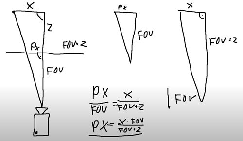

# Simple SDL2 Project Template

## Run
```
r.ps1
```

## Notes
- Weak Perspective Project



> Thanks [GraverDev - "How to make a 3D Renderer [Explained Simply]" (YouTube)](https://www.youtube.com/watch?v=nvWDgBGcAIM)